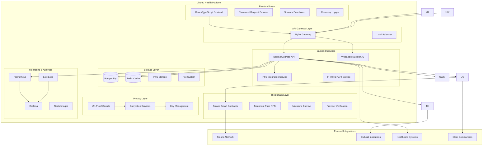

# Ubuntu Health Technical Architecture

*Comprehensive technical overview of the Ubuntu Health healthcare sponsorship platform*

## 🌍 Architecture Philosophy

Ubuntu Health's architecture embodies the Ubuntu philosophy of **"I am because we are"** through its design principles:

- **Decentralized by Design**: Blockchain-based smart contracts with no single point of failure
- **Community-Centric**: Platform connects patients, sponsors, and healthcare providers
- **Privacy-Preserving**: Zero-knowledge proofs for research contribution
- **Transparent**: All funding and milestone progress visible on blockchain
- **Scalable**: Built on Solana for high-throughput healthcare transactions

## 🏗️ System Architecture Overview



## 🧩 Component Architecture

### Frontend Components

#### React/Next.js Web Application
```
frontend/
├── components/
│   ├── ubuntu-philosophy/     # Ubuntu wisdom components
│   ├── treatment-passes/      # Healthcare access management
│   ├── community/            # Community interaction components
│   ├── governance/           # DAO participation interface
│   └── cultural/             # Cultural sensitivity features
├── pages/
│   ├── api/                  # Next.js API routes
│   ├── community/            # Community-specific pages
│   ├── healing/              # Treatment and recovery interfaces
│   └── governance/           # Governance participation
├── hooks/                    # React hooks for Ubuntu features
├── utils/                    # Ubuntu philosophy utilities
├── styles/                   # Ubuntu-themed styling
└── public/                   # Cultural assets and wisdom content
```

**Key Features:**
- Ubuntu philosophy banner with rotating wisdom quotes
- Multi-language support for global Ubuntu communities
- Cultural ceremony integration for major decisions
- Elder council interaction interfaces
- Traditional healing consultation booking

#### React Native Mobile Application
```
mobile/
├── src/
│   ├── components/
│   │   ├── ubuntu/           # Ubuntu philosophy mobile components
│   │   ├── offline/          # Offline-first healthcare access
│   │   ├── biometric/        # Secure authentication
│   │   └── cultural/         # Cultural content display
│   ├── screens/
│   │   ├── healing/          # Treatment and recovery flows
│   │   ├── community/        # Community interaction
│   │   └── wisdom/           # Ubuntu wisdom and guidance
│   ├── services/
│   │   ├── offline-sync/     # Data synchronization
│   │   ├── blockchain/       # Solana integration
│   │   └── cultural/         # Cultural content services
│   └── utils/
│       ├── ubuntu-principles/ # Ubuntu philosophy utilities
│       └── encryption/       # Privacy-preserving utilities
```

**Mobile-Specific Features:**
- Offline-capable healthcare access
- Biometric authentication with cultural respect
- GPS-based traditional healer location
- Emergency community alert system
- Cultural ceremony notifications

### Backend Architecture

#### Node.js/Express API Server
```
backend/
├── src/
│   ├── controllers/
│   │   ├── ubuntu-consensus/ # Community decision-making
│   │   ├── treatment-passes/ # Healthcare access management
│   │   ├── recovery-logs/    # Health journey documentation
│   │   ├── traditional-healing/ # Traditional medicine integration
│   │   └── governance/       # DAO governance APIs
│   ├── middleware/
│   │   ├── ubuntu-consensus/ # Community consensus validation
│   │   ├── cultural-sensitivity/ # Cultural respect enforcement
│   │   ├── elder-approval/   # Elder council integration
│   │   └── privacy-protection/ # Data protection middleware
│   ├── services/
│   │   ├── blockchain/       # Solana smart contract interaction
│   │   ├── ipfs/            # Decentralized storage
│   │   ├── zk-proofs/       # Zero-knowledge proof generation
│   │   └── community-consensus/ # Ubuntu decision-making
│   ├── models/
│   │   ├── community/        # Community data models
│   │   ├── healing/          # Healthcare data models
│   │   └── cultural/         # Cultural knowledge models
│   └── utils/
│       ├── ubuntu-philosophy/ # Ubuntu principle implementations
│       ├── encryption/       # Privacy utilities
│       └── validation/       # Cultural sensitivity validation
```

**Backend Services:**

1. **Ubuntu Consensus Service**
   - Community decision validation
   - Elder council integration
   - Traditional dialogue facilitation
   - Conflict resolution through Ubuntu principles

2. **Traditional Healing Service**
   - Traditional healer verification
   - Sacred knowledge protection
   - Cultural ceremony integration
   - Respectful healing protocol management

3. **Ubuntu Wisdom Service**
   - Daily wisdom quote generation
   - Cultural content curation
   - Elder teaching distribution
   - Community story sharing

### Blockchain Architecture

#### Solana Smart Contracts (Anchor Framework)
```
contracts/programs/
├── ubuntu-health-core/
│   ├── src/
│   │   ├── lib.rs            # Main program entry
│   │   ├── instructions/     # Community consensus instructions
│   │   ├── state/           # Ubuntu community state management
│   │   └── errors.rs        # Ubuntu-themed error handling
│   └── tests/               # Community consensus testing
├── treatment-passes/
│   ├── src/
│   │   ├── lib.rs           # Treatment pass NFT management
│   │   ├── instructions/    # Healthcare access instructions
│   │   └── validation/      # Elder council validation
├── recovery-logs/
│   ├── src/
│   │   ├── lib.rs           # Health journey documentation
│   │   ├── privacy/         # ZK-proof integration
│   │   └── community/       # Community support tracking
├── sponsorship-escrow/
│   ├── src/
│   │   ├── lib.rs           # Community sponsorship management
│   │   ├── matching/        # Sponsor-patient matching
│   │   └── ubuntu-validation/ # Ubuntu principle validation
├── soulbound-tokens/
│   ├── src/
│   │   ├── lib.rs           # Community membership tokens
│   │   ├── reputation/      # Ubuntu reputation system
│   │   └── cultural/        # Cultural contribution tracking
└── data-sharing/
    ├── src/
    │   ├── lib.rs           # Secure data sharing protocols
    │   ├── consent/         # Community consent management
    │   └── privacy/         # ZK-proof data protection
```

**Smart Contract Features:**
- Elder council multi-signature governance
- Ubuntu treasury community management
- Treatment pass NFT with cultural validation
- Recovery log documentation with privacy preservation
- Community consensus voting mechanisms
- Traditional healing protocol integration

### Privacy and Security Architecture

#### Zero-Knowledge Proof System
```
zkproofs/circuits/
├── UbuntuHealthDataAnonymizer.circom
├── CommunityConsentProof.circom
├── ElderBlessingVerification.circom
├── TraditionalHealingValidation.circom
└── CulturalSensitivityProof.circom
```

**Privacy Features:**
- Health data anonymization while preserving community benefits
- Community consent verification without exposing individual choices
- Elder blessing validation with cultural respect
- Traditional healing knowledge protection
- Cultural sensitivity automated verification

#### Encryption and Key Management
- **End-to-End Encryption**: All sensitive health data encrypted
- **Community Key Sharing**: Secure key distribution for community access
- **Elder Key Custody**: Traditional leaders hold cultural knowledge keys
- **Multi-Party Computation**: Collaborative data analysis without exposure
- **Hardware Security Modules**: Secure key storage for critical operations

### Data Architecture

#### PostgreSQL Database Schema
```sql
-- Ubuntu Health Community Schema
CREATE SCHEMA ubuntu_health;

-- Community Members with Ubuntu principles
CREATE TABLE ubuntu_health.community_members (
    id UUID PRIMARY KEY,
    ubuntu_name VARCHAR(255) NOT NULL,
    community_id UUID NOT NULL,
    elder_status BOOLEAN DEFAULT FALSE,
    cultural_contributions JSONB,
    reputation_score INTEGER DEFAULT 0,
    created_at TIMESTAMP DEFAULT NOW()
);

-- Traditional Healers with cultural respect
CREATE TABLE ubuntu_health.traditional_healers (
    id UUID PRIMARY KEY,
    member_id UUID REFERENCES ubuntu_health.community_members(id),
    healing_traditions TEXT[],
    elder_endorsements JSONB,
    sacred_knowledge_access_level INTEGER,
    cultural_ceremonies TEXT[]
);

-- Treatment Passes with community validation
CREATE TABLE ubuntu_health.treatment_passes (
    id UUID PRIMARY KEY,
    patient_id UUID REFERENCES ubuntu_health.community_members(id),
    sponsor_id UUID REFERENCES ubuntu_health.community_members(id),
    elder_blessing BOOLEAN DEFAULT FALSE,
    traditional_healing_integration BOOLEAN DEFAULT FALSE,
    community_support_score INTEGER
);

-- Recovery Logs with privacy preservation
CREATE TABLE ubuntu_health.recovery_logs (
    id UUID PRIMARY KEY,
    treatment_pass_id UUID REFERENCES ubuntu_health.treatment_passes(id),
    encrypted_data BYTEA,
    zk_proof_hash VARCHAR(64),
    community_impact_metrics JSONB,
    elder_wisdom_integration BOOLEAN DEFAULT FALSE
);
```

#### IPFS Distributed Storage
```
IPFS Storage Structure:
├── /ubuntu-wisdom/
│   ├── daily-quotes/        # Ubuntu philosophy quotes
│   ├── elder-teachings/     # Traditional wisdom content
│   ├── cultural-ceremonies/ # Ceremony documentation
│   └── community-stories/   # Healing journey stories
├── /traditional-healing/
│   ├── protocols/          # Healing protocol documentation
│   ├── sacred-knowledge/   # Protected traditional knowledge
│   ├── herbal-remedies/    # Traditional medicine information
│   └── cultural-practices/ # Respectful practice guidelines
├── /community-content/
│   ├── governance-proposals/ # DAO governance documents
│   ├── consensus-records/   # Community decision history
│   ├── cultural-events/    # Community ceremony records
│   └── healing-celebrations/ # Recovery milestone celebrations
└── /research-data/
    ├── anonymized-outcomes/ # Privacy-preserving research data
    ├── community-health/   # Collective health metrics
    ├── traditional-studies/ # Traditional medicine research
    └── cultural-impact/    # Ubuntu philosophy impact studies
```

### Monitoring and Analytics Architecture

#### Prometheus Metrics Collection
```yaml
Ubuntu Health Metrics:
- ubuntu_community_health_score: Community wellness indicator
- ubuntu_elder_council_activity: Elder participation metrics
- ubuntu_traditional_healing_sessions: Traditional medicine usage
- ubuntu_cultural_sensitivity_score: Respect for traditions
- ubuntu_consensus_participation: Community decision engagement
- ubuntu_treasury_community_impact: Resource allocation effectiveness
```

#### Grafana Dashboards
- **Community Health Dashboard**: Overall community wellness metrics
- **Elder Council Dashboard**: Traditional leadership activity and impact
- **Cultural Integration Dashboard**: Ubuntu philosophy integration success
- **Privacy Protection Dashboard**: ZK-proof usage and privacy metrics
- **Traditional Healing Dashboard**: Ancestral medicine integration success

## 🔐 Security Architecture

### Multi-Layer Security Model

1. **Application Security**
   - Input validation with cultural sensitivity
   - Rate limiting for community protection
   - OWASP compliance with Ubuntu principles
   - Cultural appropriation prevention

2. **Blockchain Security**
   - Smart contract formal verification
   - Elder council multi-signature requirements
   - Community consensus validation
   - Traditional ceremony integration for major decisions

3. **Data Security**
   - Zero-knowledge proof privacy preservation
   - End-to-end encryption for sensitive data
   - Community-controlled data sharing
   - Traditional knowledge protection protocols

4. **Infrastructure Security**
   - Container security with Ubuntu philosophy
   - Network segmentation for community services
   - Monitoring with cultural awareness
   - Incident response with elder consultation

### Compliance and Governance

#### Healthcare Compliance
- **HIPAA Compliance**: Patient data protection with community involvement
- **GDPR Compliance**: European privacy regulations with Ubuntu principles
- **FDA Guidance**: Traditional medicine integration with regulatory respect
- **Cultural Compliance**: Respectful integration of traditional practices

#### Financial Compliance
- **AML/KYC**: Anti-money laundering with community verification
- **Securities Compliance**: Token regulations with community governance
- **Cross-Border Compliance**: International healthcare access regulations
- **Tax Compliance**: Community treasury management with legal compliance

## 🚀 Deployment Architecture

### Docker Container Architecture
```yaml
Ubuntu Health Container Stack:
├── Frontend Container (React/Next.js)
├── Backend Container (Node.js/Express)
├── Ubuntu Wisdom Container (Specialized service)
├── Traditional Healing Container (Cultural service)
├── Consensus Validator Container (Blockchain service)
├── Database Container (PostgreSQL)
├── Cache Container (Redis)
├── Storage Container (IPFS)
├── Proxy Container (Nginx)
└── Monitoring Stack (Prometheus/Grafana/Loki)
```

### Kubernetes Orchestration
```yaml
Kubernetes Deployment:
├── Namespaces:
│   ├── ubuntu-health (Production)
│   ├── ubuntu-health-dev (Development)
│   ├── ubuntu-health-staging (Staging)
│   └── ubuntu-health-monitoring (Observability)
├── Deployments with Ubuntu-specific configurations
├── Services with community-focused networking
├── Ingress with cultural sensitivity routing
├── ConfigMaps with Ubuntu wisdom content
├── Secrets with elder council protection
└── PersistentVolumes for community data
```

### CI/CD Pipeline
```yaml
Ubuntu Health Pipeline:
├── Source Control (GitHub with elder review)
├── Continuous Integration:
│   ├── Cultural sensitivity testing
│   ├── Ubuntu principle compliance checking
│   ├── Smart contract formal verification
│   ├── Traditional knowledge protection validation
│   └── Community impact assessment
├── Continuous Deployment:
│   ├── Elder council approval for major releases
│   ├── Community blessing ceremony integration
│   ├── Gradual rollout with community feedback
│   └── Traditional ceremony for successful deployments
└── Monitoring and Alerting:
    ├── Community health metrics
    ├── Cultural sensitivity alerts
    ├── Elder council notification system
    └── Traditional healing integration monitoring
```

## 🌟 Future Architecture Enhancements

### Planned Improvements
1. **AI Integration**: Cultural sensitivity AI with elder training
2. **Cross-Chain**: Multi-blockchain support for global communities
3. **IoT Integration**: Traditional healing device connectivity
4. **Advanced Analytics**: Community health prediction with privacy
5. **Mobile Expansion**: Offline-first architecture improvements

### Research Directions
1. **Quantum-Resistant Cryptography**: Future-proofing community privacy
2. **Decentralized Identity**: Self-sovereign identity with Ubuntu principles
3. **Traditional Knowledge AI**: Respectful AI trained on traditional wisdom
4. **Community Mesh Networks**: Resilient communication for remote communities
5. **Cultural Ceremony VR**: Virtual reality traditional ceremony participation

## 🙏 Ubuntu Philosophy in Architecture

Every architectural decision in Ubuntu Health reflects the Ubuntu principle that "I am because we are":

- **No Single Points of Failure**: Like Ubuntu communities, our system is resilient through interconnection
- **Community-First Design**: Every component serves the collective good before individual needs
- **Elder Wisdom Integration**: Traditional leadership patterns reflected in technical governance
- **Cultural Sensitivity**: Technology adapts to culture, not the reverse
- **Collective Decision Making**: Technical decisions mirror Ubuntu consensus processes

Through this architecture, Ubuntu Health creates a technical foundation that truly embodies the healing philosophy of Ubuntu, ensuring that our technology serves not just individual health needs, but the wellness of entire communities across the globe.

---

*"Ubuntu ngumuntu ngabantu" - Through community-centered architecture, we build technology that heals not just individuals, but entire communities.*
